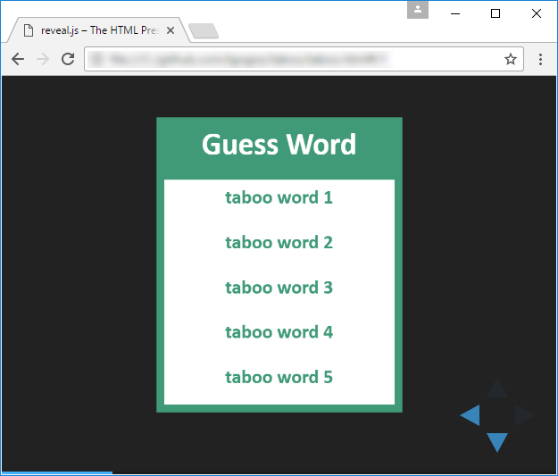

# TABOO
TABOO version to play with friends using a projector or a TV set

```
    =========    <-- monitor / wall / TV set...
       o o       <-- 2 players sit with their back to the "guess word" and
        o        <-- the 3rd player who can actually see it, tries to describe it to them.
       
They change positions clockwise if the 2 players find the word
or if the 3rd player makes a mistake during his description.
                     
The three players work as a team and try to find as many words as they can
within the time period that has been decided, let's say 2 minutes.
                     
Then another team of 3 players tries to do the same and find more words...

```

# Preview

